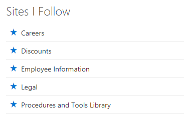

# spfx-webpart-sitesifollow

This solutions is a basic WebPart build with [SharePoint Framework](https://docs.microsoft.com/en-us/sharepoint/dev/spfx/sharepoint-framework-overview) for SharePoint Online. The webpart allows you to list all the sites you follow in a sorted order. It is also possible to filter the list based on a URL filter. 



## Not only a sample - but a full implementation
What this webpart does it not unique, and have been demonstrated many other times.

The idea of this project is not to provide a specific code sample for a WebPart, but a demonstration of a full implementation from start to end, ready for production.

Creating the project was done for my own learning, and to collect a set of good principals and guidelines from many of my former SPFx projects. At the time of writing I recommend using this baseline for any SPFx projects to maintain a minimal standard expected when delievering solutions to your clients.

## Recommondations

This example project demonstrates some important prinicipals for building custom SPFx webparts:

* PnP SPFx Controls to provide default title experience like 1. party WebParts (https://sharepoint.github.io/sp-dev-fx-controls-react/controls/WebPartTitle/)
* SPFx localization for English and Norwegian (https://docs.microsoft.com/en-us/sharepoint/dev/spfx/web-parts/guidance/localize-web-parts)
* Office UI Fabric React instead of Office UI Fabric Core (https://docs.microsoft.com/en-us/sharepoint/dev/spfx/office-ui-fabric-integration)
* SPFx theming with Office UI Fabric colors (https://docs.microsoft.com/en-us/sharepoint/dev/spfx/use-theme-colors-in-your-customizations)
* SASS for styling (https://docs.microsoft.com/en-us/sharepoint/dev/spfx/css-recommendations)
* Office UI Fabric components (https://docs.microsoft.com/en-us/sharepoint/dev/spfx/office-ui-fabric-integration)
* Reactive configuration of webpart properties (https://docs.microsoft.com/en-us/sharepoint/dev/spfx/web-parts/basics/integrate-with-property-pane)
* Service layer with mock service enabling local development and good separation in the user interface
* Placeholder for guiding users when no content is available

## Getting started

```bash
git clone the repo
npm i
gulp serve
```

## Depoyment and usage

Build the app with:

```bash
gulp bundle --ship
gulp package-solution --ship
```

Enable the app:

1. Upload the file "spfx-webpart-sitesifollow.sppkg" from  "/sharepoint/solution" to the App Catalog.
2. Go to either a modern Communication or Team Site.
3. Go to "Site contents" and add new "App"
4. Select "spfx-webpart-sitesifollow" and wait for it to be installed
5. Go to the front page, edit the page and add the "Sites I Follow" webpart

